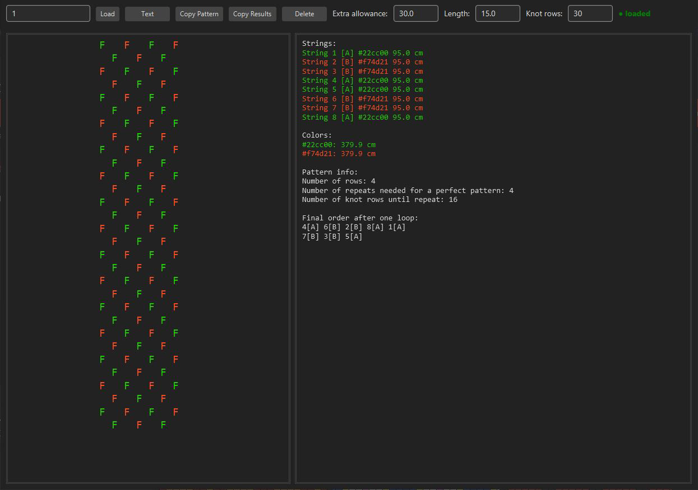
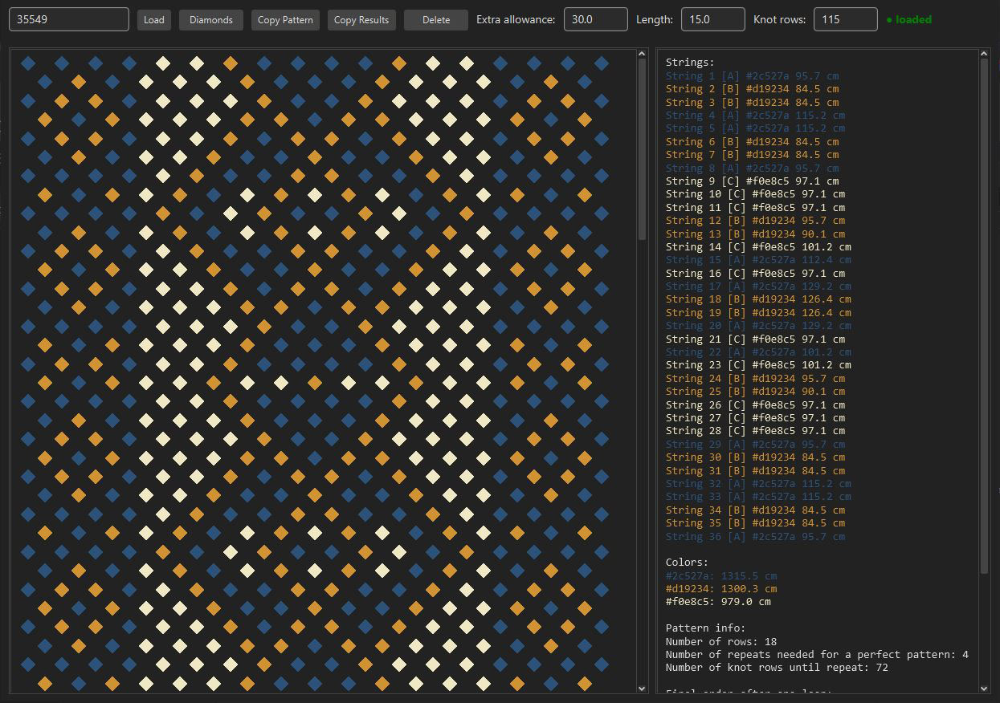

<h1>Bracelet Calculator</h1>

A desktop tool for calculating string lengths in normal friendship bracelets.

<h2>Download</h2>

  The latest builds are available here: 
  <a href="https://github.com/Rektangulo/BraceletCalculator/releases/">
    https://github.com/Rektangulo/BraceletCalculator/releases/
  </a>

<h2>Running the app</h2>

No installation is required.

<ul>
  <li>Unzip the downloaded file</li>
  <li>Run <code>BraceletCalculator</code> on your platform</li>
</ul>

<h2>Features</h2>

This tool allows you to:

<ul>
  <li>Download patterns directly from <a href="https://www.braceletbook.com">braceletbook.com</a></li>
  <li>Display, save and inspect the pattern layout</li>
  <li>Set the desired bracelet length and extra allowance on the ends</li>
  <li>Calculate string lengths and total length per colour</li>
  <li>Copy the pattern or results to the clipboard</li>
</ul>

<h2>Screenshots</h2>

  

  

<h2>Support the project</h2>

If you want to support development, you can donate here:

  

<h2>License</h2>

  This project is licensed under the MIT License. 
  See the <code>LICENSE</code> file for details.

